# Slumberscope — Senior Design Project Report

**Team Members:** Simon Alberico, Ananjin Batdelger, Aia Ahmed
**Date:** March 17, 2026
**Course:** Senior Design Project

---

## Table of Contents

1. [Introduction](#1-introduction)
2. [Problems That Will Be Solved](#2-problems-that-will-be-solved)
3. [How the Project Addresses These Problems](#3-how-the-project-addresses-these-problems)
4. [Expected Impact](#4-expected-impact)
5. [Stakeholders You Have Met](#5-stakeholders-you-have-met)
6. [Project Scope and Requirements](#6-project-scope-and-requirements)
7. [Standards, Cybersecurity Frameworks, Benchmarks and Constraints](#7-standards-cybersecurity-frameworks-benchmarks-and-constraints)
8. [System Architecture](#8-system-architecture)
9. [Context Diagram](#9-context-diagram)
10. [Data Flow Diagrams](#10-data-flow-diagrams)
11. [System Sequence Diagrams](#11-system-sequence-diagrams)
12. [Database / Data Model Design](#12-database--data-model-design)
13. [User Interface / Experience Design](#13-user-interface--experience-design)
14. [Technology Stack and Design Justification](#14-technology-stack-and-design-justification)
15. [Security and Risk Considerations](#15-security-and-risk-considerations)
16. [Alternative Designs](#16-alternative-designs)
17. [Progress and Plan for Completion](#17-progress-and-plan-for-completion)

---

## 1. Introduction

### 1.1 General Project Overview

Slumberscope is a comprehensive iOS sleep-tracking and analysis application designed to help users monitor, understand, and improve their sleep quality. The app leverages the iPhone's built-in sensors — accelerometer for movement detection and microphone for snoring analysis — combined with Apple HealthKit biometric data, AI-powered coaching, and a curated library of 180+ relaxation sounds to deliver a holistic sleep improvement platform.

The application follows a freemium business model, offering core tracking features for free while gating advanced sounds, detailed analytics, and AI coaching behind a premium subscription. Data is stored locally using SwiftData with optional cloud synchronization via Firebase and iCloud.

### 1.2 The Vision / Objectives of the Project

**Vision:** To empower every individual to achieve optimal sleep health through accessible, intelligent, and privacy-respecting technology — turning the device already on their nightstand into a comprehensive sleep laboratory.

**Objectives:**

1. **Accurate Sleep Monitoring** — Provide reliable sleep tracking using device sensors (accelerometer and microphone) without requiring additional hardware such as wearables or smart mattresses.
2. **Actionable Insights** — Deliver personalized, data-driven sleep coaching powered by on-device AI (Apple FoundationModels) that correlates lifestyle factors with sleep outcomes.
3. **Intelligent Wake-Up** — Implement a smart alarm system that detects light sleep phases within a configurable window to wake users at the optimal moment.
4. **Sleep Environment Enhancement** — Offer a curated library of 180+ relaxation sounds with mixing capabilities to help users create their ideal sleep environment.
5. **Health Ecosystem Integration** — Seamlessly synchronize sleep data with Apple Health, enabling users to view sleep alongside heart rate, HRV, blood oxygen, and other biometrics.
6. **Privacy-First Design** — Process all sensitive audio and motion data on-device, with no raw audio transmitted to external servers.
7. **Accessibility** — Provide CDC-aligned sleep recommendations personalized by age group and make the core tracking experience available at no cost.

---

## 2. Problems That Will Be Solved

### 2.1 Problem Definitions

#### Problem 1: Widespread Sleep Deprivation and Poor Sleep Quality

The Centers for Disease Control and Prevention (CDC) reports that approximately one-third of U.S. adults do not get the recommended 7+ hours of sleep per night. Poor sleep is linked to chronic conditions including obesity, diabetes, cardiovascular disease, and depression. Most individuals lack objective data about their sleep patterns and are unaware of specific factors degrading their sleep quality.

#### Problem 2: Undetected Sleep-Disordered Breathing (Snoring)

An estimated 57% of men and 40% of women snore regularly, yet many are entirely unaware of it — especially those who sleep alone. Chronic snoring can be an indicator of obstructive sleep apnea (OSA), a condition associated with increased cardiovascular risk. Without detection, individuals cannot seek appropriate medical evaluation.

#### Problem 3: Suboptimal Wake Timing

Traditional alarm clocks wake users at a fixed time regardless of their current sleep stage. Being woken during deep sleep or REM leads to sleep inertia — grogginess, impaired cognitive function, and reduced morning productivity. Users have no practical way to time their awakening to a light sleep phase.

#### Problem 4: Lack of Personalized Sleep Environment Tools

Many people struggle to fall asleep due to environmental noise, anxiety, or racing thoughts. While white noise machines and meditation apps exist, they are typically separate products that are not integrated with sleep tracking, preventing users from understanding which sounds actually improve their sleep metrics.

#### Problem 5: Fragmented Sleep Data Ecosystem

Users who want to understand their sleep often must use multiple disconnected apps and devices. Sleep data lives in one app, heart rate in another, and lifestyle habits in a journal. This fragmentation prevents holistic analysis and makes it difficult to identify cause-and-effect relationships between daily habits and sleep outcomes.

### 2.2 Why Is It Important to Solve These Problems?

| Problem | Health Impact | Economic Impact | Scale |
|---------|--------------|-----------------|-------|
| Sleep deprivation | Linked to 7 of the 15 leading causes of death in the U.S. | $411 billion annual cost to the U.S. economy (RAND) | 70 million Americans |
| Undetected snoring/OSA | 2–3x increased risk of stroke and heart attack | Untreated OSA costs ~$6,000/patient/year in excess healthcare | 22 million Americans with OSA |
| Poor wake timing | Chronic sleep inertia, reduced workplace productivity | 1.2 million working days lost annually due to insufficient sleep | Affects virtually all alarm users |
| No integrated sleep environment | Increased sleep onset latency, higher stress | Lost productivity from delayed sleep onset | 50–70 million with chronic sleep disorders |
| Fragmented data | Prevents early intervention for sleep disorders | Delayed diagnosis increases treatment costs | All health-tracking app users |

### 2.3 Who Is Affected?

**Group 1: Working Professionals (Ages 25–54)**
- Experience high stress, irregular schedules, and screen exposure before bed.
- Currently rely on consumer wearables (Fitbit, Apple Watch) that require charging and wearing to bed, or use no tracking at all.
- Without Slumberscope: They guess at their sleep quality based on how they feel, with no objective data to guide behavioral changes.

**Group 2: College Students (Ages 18–25)**
- Highly irregular sleep schedules, frequent all-nighters, high caffeine consumption.
- May not own wearable devices; smartphone is their primary technology.
- Without Slumberscope: They normalize poor sleep, have no visibility into patterns, and lack actionable guidance on which habits to change.

**Group 3: Older Adults (Ages 65+)**
- Experience natural changes in sleep architecture (less deep sleep, more awakenings).
- May snore heavily without awareness, increasing risk of undiagnosed sleep apnea.
- Without Slumberscope: They accept poor sleep as inevitable, miss opportunities for medical referral, and lack technology that adapts to their age-specific needs.

**Group 4: Partners of Snorers**
- Their sleep is disrupted by a partner's snoring, leading to relationship strain and their own sleep deprivation.
- Without Slumberscope: They have no objective record of snoring frequency/intensity to motivate the snoring partner to seek evaluation.

### 2.4 Empathy Map

The following empathy map represents **Alex**, a 32-year-old software engineer who represents our primary persona.

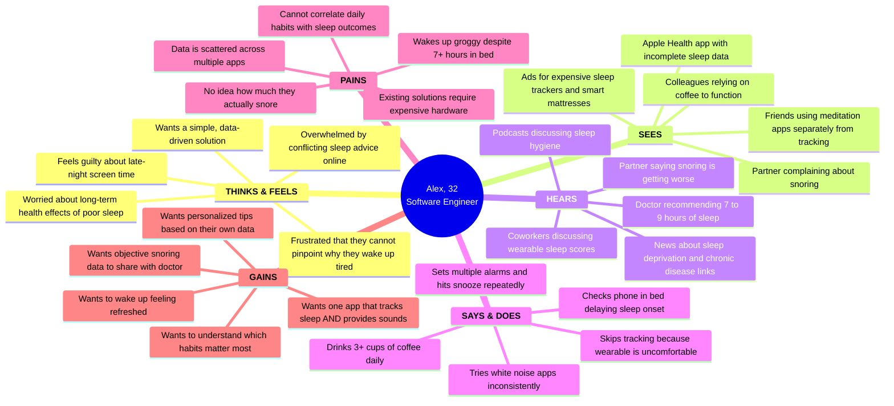

**Persona Details — Alex:**
- **Age:** 32 | **Occupation:** Software Engineer | **Location:** Urban apartment
- **Tech Comfort:** High — uses iPhone daily, familiar with health apps
- **Sleep Issues:** Wakes unrefreshed, suspected snoring, irregular bedtime due to work
- **Current Tools:** Apple Health (passive), occasionally uses a white noise app
- **Primary Pain:** Cannot connect lifestyle choices to sleep outcomes; lacks snoring awareness
- **Primary Gain:** A single, phone-based solution that tracks, analyzes, and coaches — no extra hardware required

---

## 3. How the Project Addresses These Problems

| Problem | Slumberscope Solution | Key Features |
|---------|----------------------|--------------|
| **Sleep deprivation / poor quality** | Objective sleep scoring (0–100) based on duration, quality, movement, and snoring. Factor correlation engine identifies which daily habits (caffeine, alcohol, exercise, screen time, stress, meals) improve or degrade sleep. | Sleep Score algorithm, Factor Logging, AI Coaching via FoundationModels |
| **Undetected snoring** | Real-time FFT-based audio analysis detects snoring events during sleep, records 15-second audio clips as evidence, and tracks frequency and duration over time. | AudioService with adaptive baseline calibration, snoring event recording, trend reports |
| **Suboptimal wake timing** | Smart Alarm monitors movement intensity in real-time and triggers the alarm during a detected light-sleep phase within a configurable window (default: 30 minutes before set time). | SmartAlarmService, sleep stage derivation from motion data, gradual wake-up audio ramping |
| **Lack of sleep environment tools** | Integrated sound library with 180+ sounds across 7 categories (Nature, White Noise, Ambient, Instrumental, Meditation, Stories, ASMR) with a real-time mixer and saved presets — all linked to tracking so users can see which sounds correlate with better sleep. | SoundService, SoundMixerView, SoundPreset model, premium sound gating |
| **Fragmented data ecosystem** | Single app integrates motion tracking, audio monitoring, HealthKit biometrics (HR, HRV, SpO2, temperature), weather context, and lifestyle factor logging. CSV and PDF export enable data portability. | HealthKitService, WeatherService, CSVExporter, PDFReportGenerator, Firebase cloud sync |

### Detailed Solution Flow

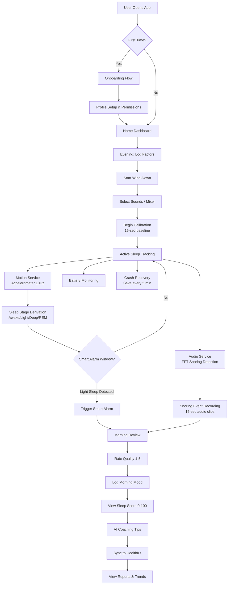

---

## 4. Expected Impact

1. **Improved Sleep Awareness** — Users will have objective, nightly sleep scores and trend data, replacing subjective guesses with data-driven understanding. We expect users to increase their average sleep awareness (knowing their actual sleep duration vs. perceived) within the first week of use.

2. **Behavioral Change Through Factor Correlation** — By correlating logged factors (caffeine, exercise, screen time, etc.) with sleep scores, users will identify the 2–3 habits most impacting their sleep and have clear motivation to modify them.

3. **Early Snoring Detection and Medical Referral** — Users who discover consistent snoring patterns through Slumberscope's audio analysis can share recorded clips and trend data with their healthcare provider, potentially leading to earlier diagnosis of obstructive sleep apnea.

4. **Reduced Sleep Inertia** — The smart alarm's light-sleep targeting is expected to reduce morning grogginess, improving users' subjective morning mood ratings over time compared to fixed-time alarms.

5. **Consolidated Health Data** — By integrating with Apple HealthKit, Slumberscope contributes to a unified health record, enabling users and their healthcare providers to view sleep alongside cardiovascular and respiratory metrics.

6. **Accessibility** — By requiring only an iPhone (no additional hardware), the solution is accessible to the estimated 130+ million iPhone users in the U.S., including demographics that cannot afford dedicated sleep tracking devices.

---

## 5. Stakeholders You Have Met

### Stakeholder 1: Professor Blake Hoppe

- **Name:** Blake Hoppe
- **Role:** Professor / Faculty Advisor
- **Organization:** University Department of Computer Science / Engineering
- **Requirement Elicitation Technique Used:** **Semi-Structured Interviews and Iterative Feedback Sessions**
  - Conducted bi-weekly one-on-one meetings where Professor Hoppe reviewed project progress, provided feedback on scope, and validated technical feasibility.
  - Used open-ended questions to understand expectations for the project deliverables, system complexity, and documentation standards.
  - Professor Hoppe provided guidance on system architecture decisions, security requirements, and the importance of measurable non-functional requirements.
  - Feedback from these sessions directly shaped the inclusion of STRIDE threat modeling, non-functional requirement measurability, and the comprehensive use-case documentation approach.

### Stakeholder 2: Professor Davide Piovesan

- **Name:** Davide Piovesan
- **Role:** Professor / Domain Expert
- **Organization:** University Department of Engineering
- **Requirement Elicitation Technique Used:** **Expert Consultation and Document Analysis**
  - Conducted focused consultation sessions where Professor Piovesan provided domain expertise on sensor data processing, signal analysis techniques, and engineering constraints.
  - Reviewed existing literature and CDC sleep guidelines together to validate the sleep scoring algorithm's weighting and thresholds.
  - Professor Piovesan's input was critical in refining the FFT-based snoring detection algorithm, calibration methodology, and sleep stage derivation thresholds.
  - Used document analysis of published research on accelerometer-based sleep staging to validate our movement intensity thresholds (awake >0.15, light 0.08–0.15, REM 0.03–0.08, deep <0.03).

### Stakeholder 3: Dr. H. Matthew Lehrer

- **Name:** H. Matthew Lehrer
- **Role:** Doctor / Professor
- **Organization:** University
- **Requirement Elicitation Technique Used:** **Structured Interviews and Requirements Workshops**
  - Conducted structured interview sessions with prepared questionnaires focused on business model viability, user experience requirements, and project management best practices.
  - Dr. Lehrer provided requirements around data privacy, user consent workflows, and the importance of clear terms of service and privacy policy integration within the app.
  - Used requirements workshop format where the team presented mockups and Dr. Lehrer provided feedback on user flow, onboarding experience, and feature prioritization.
  - His input directly influenced the freemium model design, premium feature gating strategy, and the requirement for CSV/PDF data export to ensure user data portability.

---

## 6. Project Scope and Requirements

### 6.1 Project Scope Description

Slumberscope is scoped as a native iOS application (iOS 17+) that provides end-to-end sleep health management. The system encompasses:

**In Scope:**
- Real-time sleep tracking using device accelerometer and microphone
- Sleep stage derivation (Awake, Light, Deep, REM) from motion data
- Snoring detection via FFT audio analysis with recorded audio clips
- Sleep scoring algorithm (0–100) based on duration, quality, movement, and snoring
- Lifestyle factor logging and correlation analysis
- Smart alarm with light-sleep detection
- Curated sound library (180+ sounds) with real-time mixing
- AI-powered sleep coaching (Apple FoundationModels, iOS 26+)
- Apple HealthKit integration (read/write sleep, HR, HRV, SpO2, temperature)
- User authentication via Sign in with Apple + Firebase
- Cloud synchronization (Firebase Firestore)
- Premium subscription model (StoreKit 2)
- Data export (CSV, PDF)
- Widgets (Home Screen, Lock Screen, Live Activity)
- Apple Watch connectivity (heart rate sync)
- Weather integration (WeatherKit) for morning context

**Out of Scope:**
- Android version
- Web-based dashboard
- Clinical-grade medical diagnosis
- Real-time polysomnography (PSG) replacement
- Third-party wearable integration beyond Apple Watch
- Social features or sleep data sharing between users

### 6.2 Functional Requirements

| ID | Requirement | Description |
|----|------------|-------------|
| FR-01 | Sleep Session Tracking | The system shall allow users to start, monitor, and stop a sleep tracking session that records motion intensity and audio data in real time. |
| FR-02 | Sleep Stage Derivation | The system shall derive sleep stages (Awake, Light, Deep, REM) from accelerometer data using 30-minute sliding windows and calibration-adjusted intensity thresholds. |
| FR-03 | Snoring Detection | The system shall detect snoring events using FFT-based frequency analysis of the 100–500 Hz band, with adaptive baseline calibration and configurable sensitivity (0.0–1.0). |
| FR-04 | Snoring Audio Recording | The system shall record 15-second audio clips of detected snoring events and store them locally in the Documents/SnoringClips directory. |
| FR-05 | Sleep Score Calculation | The system shall calculate a sleep score (0–100) based on weighted components: duration (35 pts), quality rating (30 pts), movement intensity (20 pts), and snoring events (15 pts). |
| FR-06 | Morning Review | The system shall present a morning review screen where users can rate sleep quality (1–5), log morning mood (1–5 emoji scale), and add notes. |
| FR-07 | Factor Logging | The system shall allow users to log lifestyle factors (caffeine, alcohol, exercise, screen time, late meal, stress, medication, custom) with intensity ratings (1–5) for any given day. |
| FR-08 | Factor Correlation Analysis | The system shall analyze correlations between logged factors and sleep metrics, requiring a minimum of 3 nights with and without each factor, and generate percentage-change insights. |
| FR-09 | Smart Alarm | The system shall monitor movement intensity during a configurable window (default 30 minutes) before the set alarm time and trigger the alarm when light sleep is detected (intensity >0.08). |
| FR-10 | Gradual Wake-Up | The system shall support a gradual wake-up mode that progressively increases alarm volume over a configurable duration (5–30 minutes). |
| FR-11 | Sound Library Playback | The system shall provide a library of 180+ categorized sounds (Nature, White Noise, Ambient, Instrumental, Meditation, Stories, ASMR) with streaming playback. |
| FR-12 | Sound Mixer | The system shall allow users to combine multiple sounds simultaneously with individual volume controls and save combinations as named presets. |
| FR-13 | Sound Timer | The system shall support an auto-stop timer (default 30 minutes) that fades out and stops sound playback after the configured duration. |
| FR-14 | User Authentication | The system shall authenticate users via Sign in with Apple, forwarding credentials to Firebase Authentication with nonce-based OAuth verification. |
| FR-15 | User Profile Management | The system shall store and sync user profile data (name, age, gender, sleep goals) to Firebase Firestore. |
| FR-16 | HealthKit Synchronization | The system shall write completed sleep sessions to Apple HealthKit and read biometric data (heart rate, HRV, SpO2, respiratory rate, wrist temperature) for the sleep window. |
| FR-17 | AI Sleep Coaching | The system shall generate personalized sleep coaching tips using Apple FoundationModels (iOS 26+), with a rule-based fallback for unsupported devices. |
| FR-18 | Calibration | The system shall perform a 15–20 second motion calibration before tracking begins, establishing a baseline intensity that is subtracted from subsequent readings. |
| FR-19 | Crash Recovery | The system shall save tracking session state every 5 minutes and offer recovery upon next app launch if a session was interrupted unexpectedly. |
| FR-20 | Bedtime & Wind-Down Reminders | The system shall send configurable bedtime reminders and wind-down notifications at user-specified times. |
| FR-21 | Sleep Schedule Management | The system shall support separate weekday and weekend sleep schedules, shift work mode, vacation mode, and custom day schedules. |
| FR-22 | Reports & Trends | The system shall display sleep trends, weekly snapshots, streak tracking, and historical session data with charts and visualizations. |
| FR-23 | Data Export | The system shall export sleep data in CSV format and generate formatted PDF sleep reports. |
| FR-24 | Premium Subscription | The system shall manage premium subscriptions (monthly, yearly, lifetime) via StoreKit 2 with transaction verification and entitlement gating. |
| FR-25 | Widgets & Live Activities | The system shall provide Home Screen widgets, Lock Screen widgets, and Live Activities showing real-time tracking status and sleep summaries. |
| FR-26 | Weather Context | The system shall retrieve current weather conditions via WeatherKit and display them in the morning review for contextual awareness. |
| FR-27 | Apple Watch Integration | The system shall communicate with a paired Apple Watch via WatchConnectivity to receive heart rate data during sleep. |
| FR-28 | Notification System | The system shall deliver local notifications for morning summaries, weekly digests, streak celebrations, goal achievements, battery warnings, and smart alarm triggers. |
| FR-29 | Sleep Focus Mode | The system shall activate the device's Sleep Focus (Do Not Disturb) mode when tracking begins, if enabled by the user. |
| FR-30 | Onboarding | The system shall guide first-time users through a multi-step onboarding flow covering account setup, permissions, and an interactive tutorial. |

### 6.3 Brief Use Case Table

| UC ID | Use Case Name | Primary Actor | Brief Description |
|-------|--------------|---------------|-------------------|
| UC-01 | Start Sleep Tracking Session | User | User initiates a sleep tracking session; system calibrates sensors and begins recording motion and audio data. |
| UC-02 | Stop Sleep Tracking Session | User | User manually stops tracking or the smart alarm ends the session; system derives sleep stages and calculates the sleep score. |
| UC-03 | Complete Morning Review | User | User rates sleep quality, logs morning mood, adds notes, and views the calculated sleep score and AI coaching tips. |
| UC-04 | Detect Snoring Event | System | System detects a snoring event via FFT audio analysis, records a 15-second audio clip, and logs the event with amplitude and duration. |
| UC-05 | Trigger Smart Alarm | System | System detects light sleep within the alarm window and triggers the alarm with the selected sound and optional gradual volume increase. |
| UC-06 | Log Lifestyle Factor | User | User logs a lifestyle factor (e.g., caffeine, exercise) with an intensity rating for the current day. |
| UC-07 | View Factor Correlations | User | User views the correlation analysis between logged factors and sleep metrics to identify habits affecting sleep quality. |
| UC-08 | Play and Mix Sounds | User | User selects one or more sounds from the library, adjusts individual volumes, and optionally saves the mix as a preset. |
| UC-09 | Sign In with Apple | User | User authenticates via Sign in with Apple; system creates or retrieves the Firebase user profile. |
| UC-10 | View Sleep Reports | User | User views sleep trend charts, weekly summaries, and historical session data in the Reports tab. |
| UC-11 | Export Sleep Data | User | User exports sleep history as a CSV file or generates a formatted PDF report for sharing with a healthcare provider. |
| UC-12 | Configure Smart Alarm | User | User sets the alarm time, wake window, alarm sound, gradual wake-up duration, and snooze preferences. |
| UC-13 | Manage Sleep Schedule | User | User configures weekday/weekend bedtimes and wake times, enables shift work mode, or activates vacation mode. |
| UC-14 | Receive AI Coaching Tip | User | After a sleep session, the system generates a personalized coaching tip based on recent trends and factor data using on-device AI. |
| UC-15 | Sync Data to HealthKit | System | System writes the completed sleep session to Apple HealthKit and reads biometric data for the sleep window. |
| UC-16 | Purchase Premium Subscription | User | User selects a subscription tier (monthly/yearly/lifetime), completes the in-app purchase, and gains access to premium features. |
| UC-17 | Recover Interrupted Session | System | On app launch, the system detects an interrupted tracking session, presents recovery options, and restores or discards the session. |
| UC-18 | Configure Tracking Sensitivity | User | User adjusts motion sensitivity, snoring sensitivity, and minimum snore duration thresholds in settings. |
| UC-19 | Manage Notifications | User | User enables/disables bedtime reminders, morning summaries, weekly digests, and other notification types. |
| UC-20 | Delete Account and Data | User | User requests account deletion; system removes Firebase auth record, Firestore profile, and all cloud-synced data. |

### 6.4 Fully Developed Use Cases

#### Fully Developed Use Case 1: Start Sleep Tracking Session (UC-01)

| Field | Description |
|-------|-------------|
| **Use Case Name** | Start Sleep Tracking Session |
| **Use Case ID** | UC-01 |
| **Primary Actor** | User |
| **Secondary Actors** | MotionService, AudioService, CalibrationService, BatteryService, CrashRecoveryService, LiveActivityService, SleepFocusService |
| **Preconditions** | 1. User is authenticated. 2. Motion and microphone permissions are granted. 3. No tracking session is currently active. 4. Device battery is above critical level (>5%). |
| **Trigger** | User taps the "Start Tracking" button on the Tonight tab. |
| **Main Success Scenario** | 1. System checks that all required permissions are granted. 2. System transitions tracking state from `idle` to `calibrating`. 3. CalibrationService begins a 15-second motion baseline measurement, collecting accelerometer samples at 10 Hz. 4. System displays a calibration progress indicator ("Place your phone on the bed and stay still"). 5. CalibrationService calculates the median intensity as the baseline and persists it to UserDefaults. 6. System transitions tracking state from `calibrating` to `tracking`. 7. MotionService starts accelerometer updates, aggregating data into 30-second windows. 8. AudioService initializes the audio engine, begins real-time FFT analysis, and establishes an adaptive noise baseline over the first 15 seconds of audio. 9. BatteryService starts monitoring battery level every 5 minutes. 10. CrashRecoveryService saves initial session state to `sleep_recovery.json`. 11. If Sleep Focus is enabled, SleepFocusService activates Do Not Disturb. 12. LiveActivityService starts a Live Activity showing elapsed time and current status. 13. If Smart Alarm is enabled, SmartAlarmService begins monitoring for the alarm window. 14. System displays the active tracking interface with real-time audio waveform visualization. 15. CrashRecoveryService auto-saves session state every 5 minutes throughout the session. |
| **Alternate Scenarios** | **4a. Calibration disabled:** System skips steps 2–5, uses the previously stored baseline (or zero if none), and transitions directly to `tracking`. **7a. Motion tracking disabled:** MotionService is not started; sleep stages will not be derived (only audio tracking occurs). **8a. Audio tracking disabled:** AudioService is not started; snoring will not be detected (only motion tracking occurs). |
| **Exception Scenarios** | **1a. Permissions not granted:** System displays a prompt directing the user to Settings to grant motion and/or microphone permissions. Use case ends. **9a. Battery critically low (<5%):** System displays a warning notification advising the user to charge the device before tracking. Tracking proceeds but with a persistent warning indicator. |
| **Postconditions** | 1. Tracking session is active with state = `tracking`. 2. Motion data points are being collected and stored in memory. 3. Audio engine is analyzing frequencies for snoring detection. 4. Crash recovery state is being saved periodically. 5. Live Activity is visible on the Lock Screen. |
| **Business Rules** | BR-1: Calibration, when enabled, must complete before tracking begins. BR-2: At least one tracking modality (motion or audio) must be active. BR-3: Session state must be recoverable in case of app crash or device restart. |

#### Fully Developed Use Case 2: Detect Snoring Event (UC-04)

| Field | Description |
|-------|-------------|
| **Use Case Name** | Detect Snoring Event |
| **Use Case ID** | UC-04 |
| **Primary Actor** | System (automated during tracking) |
| **Secondary Actors** | AudioService, SleepTrackingService |
| **Preconditions** | 1. A sleep tracking session is active (state = `tracking`). 2. Audio tracking is enabled. 3. AudioService has completed its 15-second adaptive baseline calibration. |
| **Trigger** | AudioService's real-time FFT analysis detects audio characteristics exceeding the adaptive snoring threshold. |
| **Main Success Scenario** | 1. AudioService captures an audio buffer from the microphone. 2. System calculates the RMS amplitude of the buffer. 3. System performs FFT analysis, extracting energy in the snoring frequency band (100–500 Hz). 4. System calculates the snoring band ratio (snoring band energy / total energy). 5. System compares the snoring band ratio against the adaptive threshold (baseline × sensitivity multiplier, where multiplier ranges from 1.3 at sensitivity 0.0 to 3.0 at sensitivity 1.0). 6. Snoring band ratio exceeds the threshold — system registers an audio burst with timestamp, amplitude, and duration. 7. System checks if the burst falls within 30 seconds of an existing burst group. 8. If the burst group contains 1+ bursts and the total duration exceeds the minimum snore duration threshold (user-configurable, 0.5–3.0 seconds), system finalizes the snoring event. 9. AudioService records a 15-second audio clip and saves it as a WAV file to Documents/SnoringClips/. 10. System creates a SnoringEvent object with startTime, duration, averageAmplitude, and audioFileURL. 11. SleepTrackingService appends the event to the current session's snoring events array. 12. CrashRecoveryService includes the updated snoring events in the next periodic save. 13. LiveActivityService updates the Live Activity to reflect the incremented snoring count. |
| **Alternate Scenarios** | **5a. Snoring band ratio below threshold:** No burst is registered. System continues monitoring on the next audio buffer. **7a. Burst is isolated (>30 seconds from any group):** System starts a new burst group. **8a. Burst group duration below minimum:** Group is discarded as ambient noise; no snoring event is created. |
| **Exception Scenarios** | **1a. Audio engine interrupted (phone call, Siri):** AudioService pauses detection. When the interruption ends, the audio engine restarts and recalibrates the baseline over 15 seconds before resuming detection. **9a. Storage full:** Audio clip recording fails; system logs the event without an audio file reference and continues tracking. |
| **Postconditions** | 1. Snoring event is recorded with all metadata. 2. Audio clip is saved to local storage (if successful). 3. Session snoring count is incremented. 4. Live Activity display is updated. |
| **Business Rules** | BR-1: Sensitivity multiplier must scale linearly between 1.3 (most sensitive) and 3.0 (least sensitive). BR-2: Minimum snore duration is user-configurable between 0.5 and 3.0 seconds. BR-3: Audio clips must be stored locally only — never transmitted to external servers. |

#### Fully Developed Use Case 3: Trigger Smart Alarm (UC-05)

| Field | Description |
|-------|-------------|
| **Use Case Name** | Trigger Smart Alarm |
| **Use Case ID** | UC-05 |
| **Primary Actor** | System (automated) |
| **Secondary Actors** | SmartAlarmService, MotionService, SleepTrackingService, NotificationService |
| **Preconditions** | 1. A sleep tracking session is active. 2. Smart Alarm is enabled with a configured alarm time and wake window. 3. Current time is within the wake window (e.g., 30 minutes before alarm time). |
| **Trigger** | SmartAlarmService detects movement intensity >0.08 (indicating light sleep) during the wake window. |
| **Main Success Scenario** | 1. SmartAlarmService receives the latest movement intensity from MotionService. 2. System checks if the current time falls within the wake window (alarm time minus window minutes). 3. Movement intensity exceeds the light-sleep threshold (0.08). 4. SmartAlarmService marks the alarm as triggered. 5. If gradual wake-up is enabled, system begins playing the selected alarm sound at minimum volume and progressively increases it over the configured duration (default 5 minutes). 6. If gradual wake-up is disabled, system plays the alarm sound at full volume immediately. 7. System fires a local notification: "Good morning! Light sleep detected — time to wake up." 8. System displays the alarm UI with Dismiss and Snooze buttons. 9. Alarm sound repeats every 3 seconds if not acknowledged. 10. User taps Dismiss. 11. System stops the alarm sound. 12. SleepTrackingService transitions to the `completing` state. 13. System derives sleep stages and calculates the sleep score. 14. System transitions to the Morning Review screen. |
| **Alternate Scenarios** | **3a. No light sleep detected during entire window:** When the alarm time is reached without light-sleep detection, system triggers the alarm at the exact set time as a standard alarm. **10a. User taps Snooze:** System stops the alarm, schedules a new alarm for the current time + snooze duration, and returns to tracking. When the snooze period expires, the alarm triggers again (returning to step 5 or 6). |
| **Exception Scenarios** | **2a. User disabled smart alarm mid-session:** SmartAlarmService stops monitoring; no alarm is triggered. User must manually stop tracking. **6a. Device is in Silent mode:** System uses haptic vibration in addition to any audio output to ensure the user is alerted. |
| **Postconditions** | 1. User is awake and has dismissed the alarm. 2. Tracking session has transitioned to completing/done. 3. Sleep stages and score have been calculated. 4. Morning Review is displayed. |
| **Business Rules** | BR-1: The light-sleep threshold (0.08) is derived from calibration-adjusted motion intensity. BR-2: If no light sleep is detected, the alarm must still fire at the exact set time. BR-3: Gradual wake-up volume progression must be linear over the configured duration. |

#### Fully Developed Use Case 4: Play and Mix Sounds (UC-08)

| Field | Description |
|-------|-------------|
| **Use Case Name** | Play and Mix Sounds |
| **Use Case ID** | UC-08 |
| **Primary Actor** | User |
| **Secondary Actors** | SoundService, StoreKitService |
| **Preconditions** | 1. User is on the Tonight tab or Sound Library screen. 2. Device audio output is functional. |
| **Trigger** | User navigates to the Sound Library or taps a sound category. |
| **Main Success Scenario** | 1. System displays the Sound Library organized by 7 categories: Nature, White Noise, Ambient, Instrumental, Meditation, Stories, ASMR. 2. User selects a category and browses available sounds. 3. User taps a sound to preview it. 4. SoundService begins streaming audio playback of the selected sound. 5. System displays the Audio Player with play/pause, volume slider, and a timer setting. 6. User taps the Mixer button to open the Sound Mixer view. 7. User selects additional sounds to add to the mix (up to the mixer limit). 8. For each sound in the mix, the system displays an individual volume slider. 9. User adjusts individual volumes to create their desired soundscape. 10. User taps "Save Preset" and enters a name. 11. System creates a SoundPreset object with the name and an array of SoundPresetItems (sound ID + volume). 12. System persists the preset to SwiftData. 13. User sets the auto-stop timer (default 30 minutes). 14. System begins the countdown; at timer expiration, system fades out audio over 10 seconds and stops playback. |
| **Alternate Scenarios** | **3a. Sound is premium-only and user is not subscribed:** System displays a PremiumGate overlay explaining that the sound requires a subscription. User can tap "Upgrade" to navigate to the subscription screen (UC-16) or dismiss. **10a. User does not save preset:** User continues listening without saving; the mix is active only for the current session. **13a. User does not set timer:** Sound plays continuously until manually stopped or tracking session ends. |
| **Exception Scenarios** | **4a. Audio file not found or corrupted:** System displays an error message ("Unable to play this sound") and logs the error. The sound is skipped. **7a. Audio engine conflict with tracking:** SoundService coordinates with AudioService to ensure snoring detection microphone input is not disrupted by sound output. System uses separate audio sessions. |
| **Postconditions** | 1. Selected sounds are playing (or stopped if timer expired). 2. If saved, the preset is persisted and available in the Presets list. 3. Sound playback does not interfere with sleep tracking audio analysis. |
| **Business Rules** | BR-1: Premium sounds must not be playable without an active subscription. BR-2: Sound playback must not interfere with microphone-based snoring detection. BR-3: Saved presets must persist across app sessions. |

#### Fully Developed Use Case 5: Export Sleep Data (UC-11)

| Field | Description |
|-------|-------------|
| **Use Case Name** | Export Sleep Data |
| **Use Case ID** | UC-11 |
| **Primary Actor** | User |
| **Secondary Actors** | CSVExporter, PDFReportGenerator |
| **Preconditions** | 1. User is authenticated. 2. At least one completed sleep session exists in the local database. 3. User is on the Reports tab. |
| **Trigger** | User taps the "Export" button in the Reports tab. |
| **Main Success Scenario** | 1. System presents export format options: CSV or PDF. 2. User selects CSV. 3. CSVExporter queries all SleepSession records from SwiftData. 4. For each session, the exporter extracts: start time, end time, duration, sleep score, quality rating, morning mood, average movement intensity, snoring count, sleep efficiency, and awakenings count. 5. System generates a formatted CSV file with headers and one row per session. 6. System presents the iOS Share Sheet with the CSV file attached. 7. User selects a destination (Files, Email, AirDrop, etc.). 8. File is exported to the selected destination. |
| **Alternate Scenarios** | **2a. User selects PDF:** PDFReportGenerator creates a formatted PDF document containing: summary statistics (average score, total sessions, average duration), a sleep score trend chart, a table of recent sessions, and factor correlation insights. System presents the Share Sheet with the PDF. **7a. User cancels the Share Sheet:** Export is cancelled; no file is shared. The generated file is discarded. |
| **Exception Scenarios** | **3a. No sessions found:** System displays a message: "No sleep data to export. Complete at least one tracking session first." Use case ends. **5a. File generation fails (storage error):** System displays an error notification and logs the failure. |
| **Postconditions** | 1. User has received the exported file in their chosen format. 2. No data has been modified or deleted from the local database. 3. Export action is logged for analytics. |
| **Business Rules** | BR-1: Exported data must include all completed sessions, not partial/interrupted ones. BR-2: CSV must use standard comma delimiters and UTF-8 encoding for compatibility. BR-3: PDF reports must include the Slumberscope branding. |

### 6.5 Non-Functional Requirements

#### Usability Requirements

| ID | Requirement | Measure |
|----|------------|---------|
| NFR-U1 | The onboarding flow shall be completable by a first-time user within 3 minutes. | Measured via usability testing with 5 participants; 90% complete within 3 minutes. |
| NFR-U2 | The sleep tracking start process (from tapping "Start" to active tracking) shall require no more than 2 taps after the initial tap, excluding calibration wait time. | Counted by UI interaction steps. |
| NFR-U3 | The app shall follow Apple Human Interface Guidelines for all navigation patterns, ensuring that iOS users can navigate without instruction. | Verified by Apple HIG compliance checklist review. |
| NFR-U4 | Error messages shall clearly describe the issue and provide an actionable resolution (e.g., "Microphone permission required. Tap here to open Settings."). | Reviewed in all error-handling code paths. |

#### Efficiency / Performance Requirements

| ID | Requirement | Measure |
|----|------------|---------|
| NFR-E1 | The app shall consume no more than 15% battery per 8-hour tracking session on an iPhone 14 or newer. | Measured using Xcode Energy Diagnostics over 3 test sessions. |
| NFR-E2 | Sleep score calculation shall complete within 2 seconds of session completion for a session with up to 1,000 movement data points and 100 snoring events. | Timed programmatically in release builds. |
| NFR-E3 | The sound library shall begin audio playback within 1 second of user selection. | Measured from tap event to first audio output. |
| NFR-E4 | The app's cold launch time shall not exceed 3 seconds on an iPhone 14 or newer. | Measured using Xcode Instruments launch profiling. |

#### Reliability Requirements

| ID | Requirement | Measure |
|----|------------|---------|
| NFR-R1 | The crash recovery system shall successfully restore at least 95% of interrupted sessions, losing no more than 5 minutes of tracking data. | Tested by force-killing the app during tracking and measuring data loss. |
| NFR-R2 | The app shall maintain a crash-free rate of at least 99.5% as measured over any 30-day rolling window. | Monitored via Firebase Crashlytics. |

#### Security and Privacy Requirements

| ID | Requirement | Measure |
|----|------------|---------|
| NFR-S1 | All authentication tokens shall be stored in the iOS Keychain, never in UserDefaults or plain files. | Verified by code audit of all credential storage paths. |
| NFR-S2 | Audio recordings of snoring events shall be stored exclusively on the local device filesystem and shall never be transmitted to any external server. | Verified by network traffic analysis during tracking sessions. |
| NFR-S3 | The system shall implement nonce-based OAuth verification for Sign in with Apple to prevent replay attacks. | Verified by inspecting the authentication flow and Firebase configuration. |
| NFR-S4 | User account deletion shall cascade-delete all associated data from Firebase Authentication, Firestore user profile, and Firestore synced settings within 30 seconds. | Tested by deleting a test account and verifying Firebase console. |
| NFR-S5 | All network communications with Firebase and Apple services shall use TLS 1.2 or higher (enforced by iOS App Transport Security). | Verified by ATS configuration review and network traffic inspection. |
| NFR-S6 | The system shall request only the minimum required device permissions (microphone, motion, HealthKit, notifications, location) and shall function with degraded capability if any optional permission is denied. | Tested by denying each permission individually and verifying graceful degradation. |
| NFR-S7 | Sensitive health data from HealthKit (heart rate, HRV, SpO2, temperature) shall only be accessed within the authorized HealthKit sandbox and shall not be persisted outside of HealthKit or the local SwiftData store. | Verified by code audit of HealthKitService data handling. |

#### Scalability Requirements

| ID | Requirement | Measure |
|----|------------|---------|
| NFR-SC1 | The local SwiftData store shall handle at least 365 sleep sessions (1 year of nightly data) without degradation in query performance beyond 500ms for any single query. | Load-tested with synthetic data. |

---

## 7. Standards, Cybersecurity Frameworks, Benchmarks and Constraints

### 7.1 Standards, Cybersecurity Frameworks, and Benchmarks

#### Standard 1: OWASP Mobile Application Security Verification Standard (MASVS)

- **Name:** OWASP Mobile Application Security Verification Standard (MASVS) v2.0
- **URL:** https://mas.owasp.org/MASVS/
- **Summary:** MASVS is a comprehensive security standard for mobile applications that defines security requirements across categories including data storage, cryptography, authentication, network communication, platform interaction, and code quality. It provides three verification levels (L1, L2, R) for different risk profiles.
- **Relation to Project:** Slumberscope collects sensitive health data (sleep patterns, audio recordings, biometrics from HealthKit) and handles user authentication. MASVS provides the framework to ensure this data is properly protected at rest and in transit.
- **How We Apply It:**
  - **MASVS-STORAGE:** All sensitive data (credentials in Keychain, health data in SwiftData, audio in local filesystem) follows MASVS storage guidelines. No sensitive data is stored in UserDefaults except non-sensitive preferences.
  - **MASVS-CRYPTO:** We rely on Apple's built-in cryptographic implementations (Keychain encryption, TLS via ATS) rather than custom cryptography.
  - **MASVS-AUTH:** Sign in with Apple with nonce-based OAuth prevents replay attacks; Firebase handles session management.
  - **MASVS-NETWORK:** iOS App Transport Security (ATS) enforces TLS 1.2+ for all network connections.
  - **MASVS-PLATFORM:** We request minimum permissions, use the iOS sandbox, and follow Apple's data protection guidelines.
  - **Documentation:** Security controls are mapped to MASVS categories in our threat model (Section 15).

#### Standard 2: NIST Cybersecurity Framework (CSF) 2.0

- **Name:** NIST Cybersecurity Framework (CSF) 2.0
- **URL:** https://www.nist.gov/cyberframework
- **Summary:** The NIST CSF provides a taxonomy of cybersecurity outcomes organized into six functions: Govern, Identify, Protect, Detect, Respond, and Recover. It is widely adopted across industries as a risk-based approach to managing cybersecurity.
- **Relation to Project:** As Slumberscope processes personal health information and biometric data, the NIST CSF provides a structured approach to identifying risks, implementing protections, and planning incident response.
- **How We Apply It:**
  - **Identify (ID):** Asset inventory documented in Section 15 (critical assets). Data flow diagrams identify all data stores and transmission paths.
  - **Protect (PR):** Authentication via Sign in with Apple, Keychain credential storage, on-device data processing, minimum permission model.
  - **Detect (DE):** Firebase Crashlytics monitors app health; structured logging with AppLogger captures security-relevant events across 14 categories.
  - **Respond (RS):** Crash recovery service preserves user data during failures; account deletion provides user-initiated data removal.
  - **Recover (RC):** CrashRecoveryService auto-saves every 5 minutes; iCloud/Firebase sync enables data restoration on new devices.

#### Standard 3: Apple App Store Review Guidelines & Privacy Requirements

- **Name:** Apple App Store Review Guidelines (Section 5: Privacy)
- **URL:** https://developer.apple.com/app-store/review/guidelines/#privacy
- **Summary:** Apple's guidelines mandate specific privacy practices for apps distributed via the App Store, including data collection transparency, purpose limitation, user consent, and compliance with the App Tracking Transparency framework. Apps accessing HealthKit must meet additional requirements for health data handling.
- **Relation to Project:** Slumberscope must comply with these guidelines to be published on the App Store. The app accesses HealthKit, microphone, motion sensors, and location — all categories with specific Apple requirements.
- **How We Apply It:**
  - **Privacy Nutrition Labels:** PrivacyInfo.xcprivacy file is included in the project, declaring all data collection types and purposes.
  - **HealthKit Compliance:** Sleep data is written/read via authorized HealthKit APIs only; health data is never shared with third parties.
  - **Permission Prompts:** PermissionService provides clear, contextual explanations for each permission request (microphone, motion, HealthKit, notifications, location).
  - **Data Minimization:** Audio recordings are stored locally only; raw audio streams are not transmitted externally.
  - **Account Deletion:** Full account and data deletion capability as required by App Store guidelines (effective 2022).

#### Standard 4: HIPAA Security Rule (Awareness)

- **Name:** Health Insurance Portability and Accountability Act (HIPAA) Security Rule
- **URL:** https://www.hhs.gov/hipaa/for-professionals/security/index.html
- **Summary:** HIPAA's Security Rule establishes national standards for protecting electronic protected health information (ePHI). It requires administrative, physical, and technical safeguards for entities handling health data.
- **Relation to Project:** While Slumberscope is a consumer wellness app (not a covered entity under HIPAA), the health-adjacent nature of sleep data, snoring recordings, and HealthKit biometrics means that adopting HIPAA-aligned practices enhances user trust and prepares the platform for potential future clinical integrations.
- **How We Apply It:**
  - **Why awareness, not full compliance:** Slumberscope does not process ePHI as defined by HIPAA (we are not a healthcare provider, health plan, or clearinghouse). Full HIPAA compliance is not legally required.
  - **HIPAA-aligned practices we adopt:** Encryption at rest (iOS Data Protection), encryption in transit (TLS 1.2+), access controls (authentication required), audit logging (AppLogger), data integrity (SwiftData transaction safety).
  - **Future consideration:** If Slumberscope were to integrate with healthcare providers or accept insurance data, full HIPAA compliance would be pursued, including a Business Associate Agreement (BAA) with Firebase/Google Cloud.

### 7.2 Constraints

#### Constraint 1: iOS Platform Exclusivity

- **Name:** iOS-Only Platform Constraint
- **Relation:** The application is built exclusively with SwiftUI and Apple frameworks (HealthKit, CoreMotion, AVFoundation, WeatherKit, FoundationModels), which are not available on Android or web platforms.
- **How We Address It:** We accept this constraint as a deliberate design decision. The iPhone's 57% U.S. market share provides a large addressable market. Native development enables deep sensor integration, HealthKit access, and performance optimization that cross-platform frameworks cannot match. An Android version is listed as future work beyond the senior design scope.

#### Constraint 2: On-Device AI Availability (iOS 26+)

- **Name:** FoundationModels Framework Availability
- **Relation:** The AI-powered sleep coaching feature uses Apple's FoundationModels API, which requires iOS 26 or later and specific device hardware (Apple Silicon with sufficient Neural Engine capacity).
- **How We Address It:** We implement a dual-path architecture: FoundationModels for supported devices and a rule-based fallback coaching engine (in FactorService) for older devices. The rule-based system generates tips based on the same data (sleep trends, factors, scores) using conditional logic rather than generative AI, ensuring all users receive coaching regardless of device capability.

#### Constraint 3: No Background Audio Recording on iOS

- **Name:** iOS Background Audio Processing Limitation
- **Relation:** iOS restricts continuous microphone access in the background. The app must maintain an active audio session to perform snoring detection, which requires specific audio session category configuration and background mode entitlements.
- **How We Address It:** The app configures the audio session for recording with background capability. The Live Activity and background audio session keep the app active during tracking. Users are informed during onboarding that the phone should remain plugged in and nearby for reliable tracking.

#### Constraint 4: HealthKit Data Sandbox

- **Name:** Apple HealthKit Data Access Restrictions
- **Relation:** HealthKit enforces strict access controls — apps can only read data types the user has explicitly authorized, and HealthKit data cannot be stored in iCloud or transmitted to third-party servers (per Apple guidelines).
- **How We Address It:** HealthKitService only requests authorization for specific data types needed (sleep analysis, heart rate, HRV, SpO2, respiratory rate, temperature). All HealthKit data is processed in-memory and displayed in the UI; it is not persisted to SwiftData or synced to Firebase. This maintains compliance with Apple's HealthKit requirements.

#### Constraint 5: Budget and Hardware Constraint

- **Name:** Student Project Budget Limitation
- **Relation:** As a senior design project, there is no budget for paid backend infrastructure, third-party APIs, or commercial sound licensing beyond free tiers.
- **How We Address It:** We leverage free-tier services: Firebase free tier (50K reads/day, 20K writes/day, 1 GiB storage), Apple's included frameworks (HealthKit, WeatherKit, FoundationModels), and StoreKit's sandbox testing. Sound files are created or sourced from royalty-free libraries. The on-device processing model minimizes server costs.

---

## 8. System Architecture

### 8.1 High-Level Architectural Diagram

Slumberscope follows a **client-heavy architecture** where the majority of processing (sensor data collection, sleep stage derivation, snoring detection, AI coaching) occurs on-device. Cloud services handle authentication, user profile sync, and optional data backup.

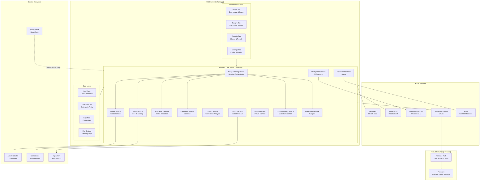

### 8.2 Secure System Architecture

The following diagram highlights security boundaries and controls applied to the architecture.

```mermaid
flowchart TB
    subgraph TrustBoundary1["Trust Boundary: User Device (iOS Sandbox)"]
        subgraph AppSandbox["App Sandbox (Encrypted at Rest)"]
            APP["Slumberscope App"]
            SD["SwiftData Store<br/>📋 iOS Data Protection"]
            KC["Keychain<br/>🔐 Hardware-Backed Encryption"]
            UD["UserDefaults<br/>📋 Non-Sensitive Only"]
            CLIPS["Snoring Audio Clips<br/>📋 Local Only, Never Transmitted"]
        end

        subgraph OSServices["OS-Managed Services"]
            HK["HealthKit Sandbox<br/>🔐 Separate Encryption Domain"]
            CM["CoreMotion<br/>🛡️ Permission-Gated"]
            AV["AVFoundation<br/>🛡️ Permission-Gated"]
            LOC["Location Services<br/>🛡️ When-In-Use Only"]
        end
    end

    subgraph TrustBoundary2["Trust Boundary: Network (TLS 1.2+)"]
        subgraph FirebaseCloud["Firebase (Google Cloud)"]
            FA["Firebase Auth<br/>🔐 Nonce-Based OAuth"]
            FFS["Firestore<br/>🛡️ Security Rules"]
        end

        subgraph AppleCloud["Apple Services"]
            SIWA["Sign in with Apple<br/>🔐 OAuth 2.0 + PKCE"]
            WK["WeatherKit API<br/>🔑 API Key Auth"]
            APNS["APNs<br/>🔐 Token-Based"]
        end
    end

    APP -->|"Auth Token (Keychain)"| FA
    APP -->|"Nonce + OAuth"| SIWA
    SIWA -->|"Identity Token"| FA
    APP -->|"Authenticated Writes"| FFS
    APP -->|"TLS 1.2+"| WK
    APP -->|"Device Token"| APNS

    APP -->|"Authorized Read/Write"| HK
    APP -->|"Permission Required"| CM
    APP -->|"Permission Required"| AV
    APP -->|"When-In-Use"| LOC

    APP --> SD
    APP --> KC
    APP --> UD
    APP --> CLIPS

    style KC fill:#2d5016,color:#fff
    style HK fill:#2d5016,color:#fff
    style FA fill:#1a3a5c,color:#fff
    style SIWA fill:#1a3a5c,color:#fff
    style CLIPS fill:#5c3a1a,color:#fff
```

**Security Controls Summary:**
- **Authentication:** Sign in with Apple (OAuth 2.0 with nonce) → Firebase Auth
- **Credential Storage:** iOS Keychain (hardware-backed encryption)
- **Data at Rest:** iOS Data Protection (file-level encryption tied to device passcode)
- **Data in Transit:** TLS 1.2+ enforced by App Transport Security
- **Health Data:** HealthKit sandbox (separate encryption domain, Apple-managed)
- **Audio Privacy:** Snoring clips stored locally only, never transmitted
- **Permissions:** Minimum required; graceful degradation if denied
- **Cloud Security:** Firestore Security Rules restrict access to authenticated user's own data

---

## 9. Context Diagram

### Level 0 Context Diagram

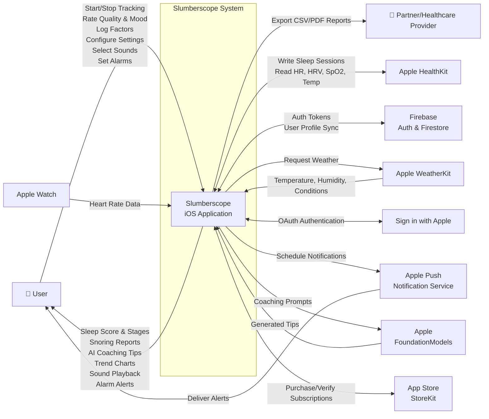

---

## 10. Data Flow Diagrams

### 10.1 DFD Level 1

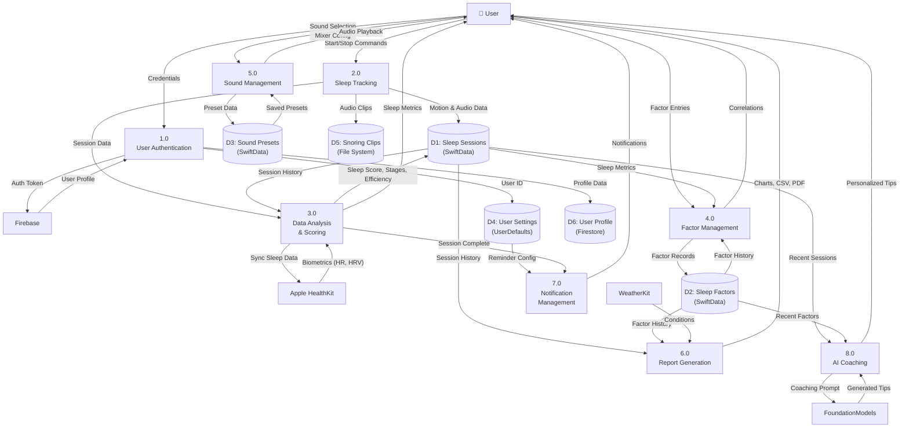

### 10.2 DFD Level 2 — Process 2.0: Sleep Tracking (Expanded)

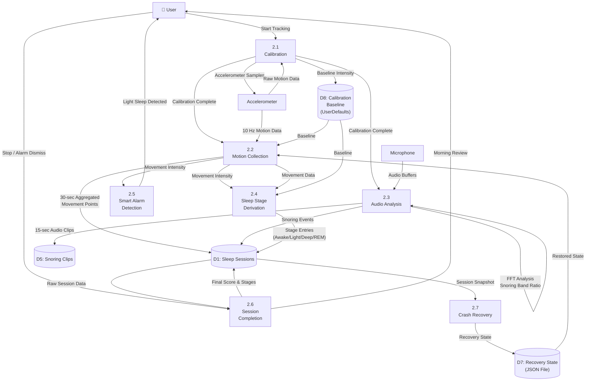

---

## 11. System Sequence Diagrams

### 11.1 Overall System Process: Complete Sleep Tracking Lifecycle

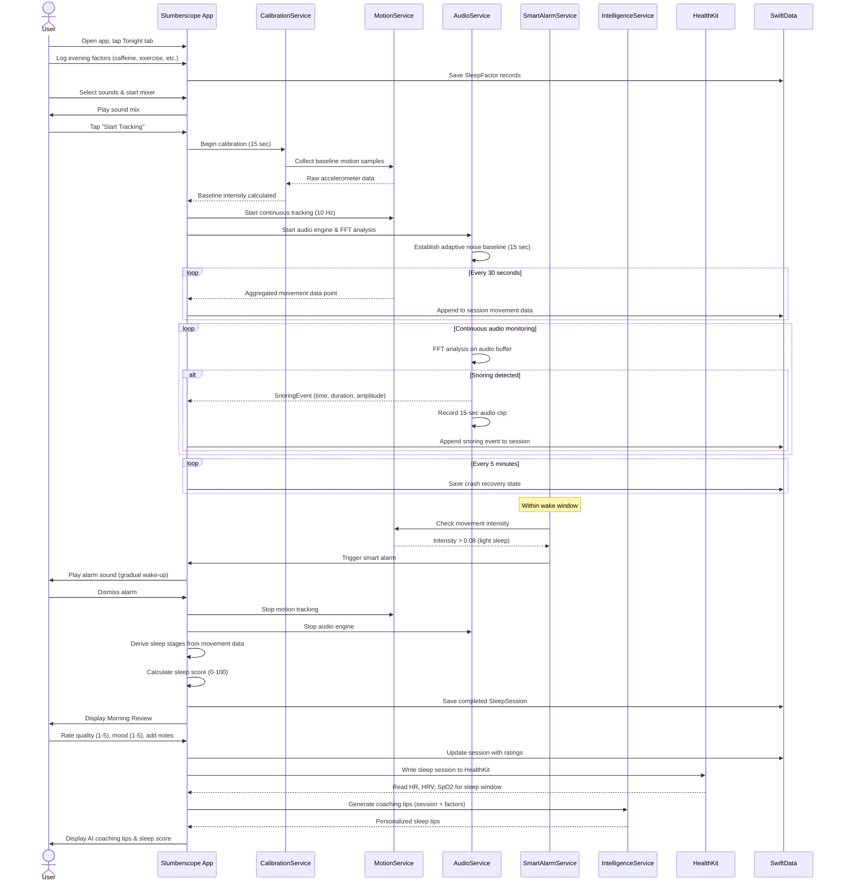

### 11.2 Most Complex Process: Snoring Detection Pipeline

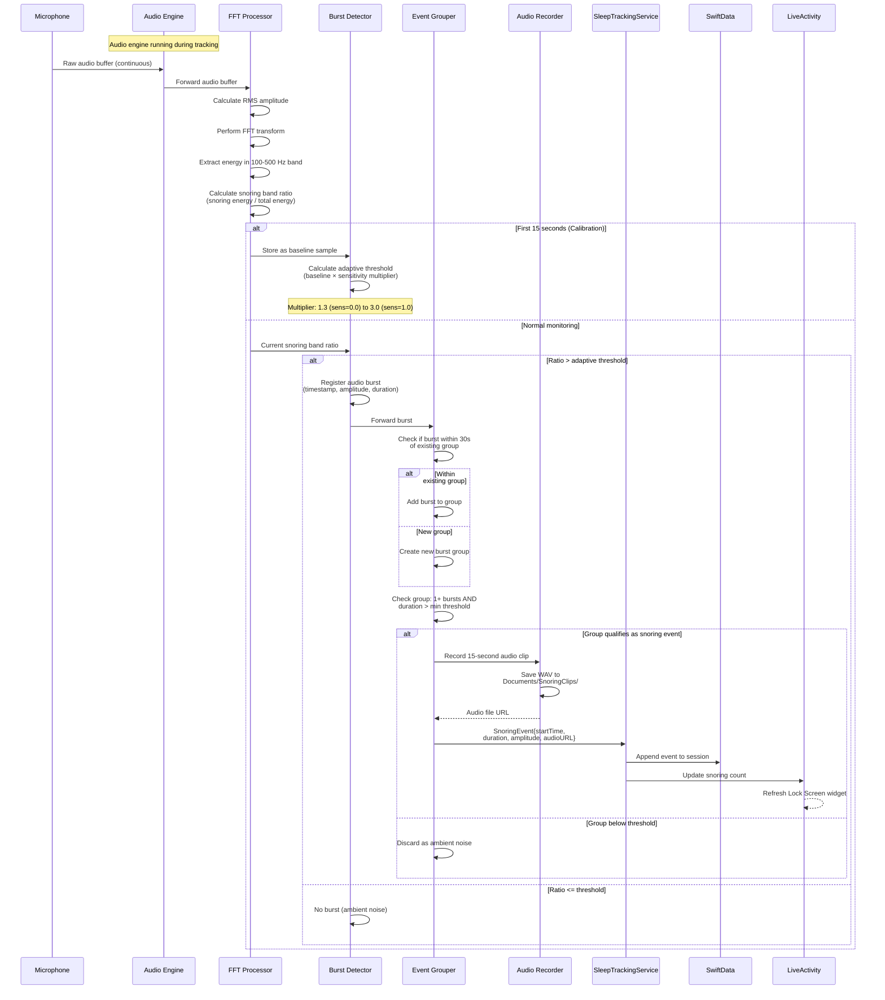

---

## 12. Database / Data Model Design

### Entity-Relationship Diagram

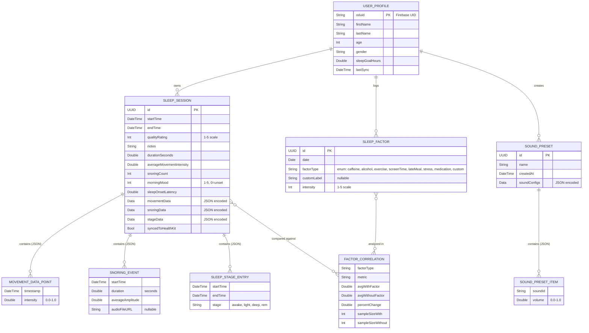

**Design Notes:**

1. **JSON-Encoded Complex Data:** Movement data points, snoring events, and sleep stage entries are stored as JSON-encoded `Data` blobs within the `SleepSession` model rather than as separate SwiftData entities. This design decision reduces database complexity, eliminates join queries for the most common read pattern (loading a single session with all its data), and simplifies the CloudKit sync model.

2. **Three Core SwiftData Models:** The database contains exactly three persistent models — `SleepSession`, `SleepFactor`, and `SoundPreset` — managed through a single SwiftData `ModelContainer`. This keeps the schema simple and migration-friendly.

3. **User Profile in Firestore:** User profile data (name, age, gender, sleep goal) is stored in Firebase Firestore rather than SwiftData. This enables cross-device sync without CloudKit and simplifies the authentication flow.

4. **Factor Correlations are Computed:** `FactorCorrelation` results are computed on-the-fly by `FactorService` from the raw `SleepSession` and `SleepFactor` data. They are not persisted to the database, ensuring they are always up-to-date.

---

## 13. User Interface / Experience Design

### 13.1 UI Navigation Flow

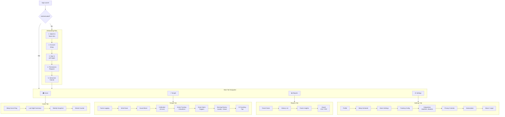

### 13.2 Key Screen Wireframes (Descriptions)

#### Home Screen
- **Top:** Circular sleep score ring (0–100) with the score prominently displayed in the center. Color gradient from red (low) through yellow (medium) to green (high).
- **Middle:** "Last Night" card showing duration, bedtime, wake time, and snoring count. Glass-effect card styling (GlassCard component).
- **Bottom:** Weekly bar chart showing the last 7 days of sleep scores. Current streak counter with flame icon.

#### Tonight / Active Tracking Screen
- **Top:** Large elapsed time counter ("6h 32m").
- **Center:** Real-time audio waveform visualization (AudioWaveformView) showing ambient and snoring audio levels.
- **Bottom-Left:** Current detected sleep stage badge (e.g., "Deep Sleep").
- **Bottom-Right:** Snoring event counter with microphone icon.
- **Bottom:** "Stop Tracking" button (red, prominent).
- **Floating:** Battery level indicator in top corner.

#### Morning Review Screen
- **Top:** Sleep score ring with calculated score.
- **Section 1:** Duration bar showing time in bed vs. time asleep.
- **Section 2:** Sleep stage breakdown — horizontal stacked bar (Awake=red, Light=blue, Deep=purple, REM=cyan) with percentage labels.
- **Section 3:** Quality rating selector (5 stars).
- **Section 4:** Mood selector (5 emoji faces: 😫😴😐😊🤩).
- **Section 5:** Notes text field.
- **Section 6:** Snoring summary (count, total duration, audio clips playback).
- **Bottom:** AI coaching tip card.

#### Sound Mixer Screen
- **Top:** Category selector (horizontal scroll: Nature, White Noise, Ambient, etc.).
- **Grid:** Sound tiles with name and play button. Premium sounds show a lock icon.
- **Bottom Panel:** Active mixer showing currently playing sounds, each with a volume slider and remove button.
- **Footer:** Timer setting, Save Preset button.

#### Reports / Insights Screen
- **Top Toggle:** Weekly / Monthly / All Time.
- **Chart 1:** Sleep score line chart over time.
- **Chart 2:** Sleep duration bar chart.
- **Section:** Factor correlation cards showing "Caffeine: -12% sleep score" or "Exercise: +18% sleep score" with color-coded impact indicators.
- **Button:** Export (CSV/PDF).

---

## 14. Technology Stack and Design Justification

| Technology | Category | Justification |
|-----------|----------|---------------|
| **Swift** | Programming Language | Apple's modern, type-safe language required for iOS development. Memory safety features prevent common vulnerabilities. The team has strong Swift experience. |
| **SwiftUI** | UI Framework | Declarative UI framework that reduces boilerplate, enables reactive state management via `@Observable`, and provides built-in support for animations, accessibility, and dark mode. Chosen over UIKit for faster development velocity and modern iOS alignment. |
| **SwiftData** | Local Database | Apple's native persistence framework (successor to Core Data) with automatic schema migration, Swift-native model definitions, and seamless SwiftUI integration. Chosen over SQLite/Realm for zero-dependency native integration and simpler API. |
| **Firebase Authentication** | Auth Service | Industry-standard authentication service with built-in Sign in with Apple support, token management, and account deletion APIs. Free tier supports up to 10K monthly active users. Chosen over custom auth for security and reliability. |
| **Firebase Firestore** | Cloud Database | NoSQL document database for user profile and settings sync. Real-time sync capabilities, offline support, and security rules for access control. Free tier provides 50K reads/20K writes per day. Chosen over CloudKit for cross-platform future potential and simpler API. |
| **CoreMotion** | Sensor Framework | Apple's framework for accelerometer and gyroscope data. Provides calibrated motion data at configurable sampling rates. The only option for accessing iOS motion sensors. |
| **AVFoundation** | Audio Framework | Apple's comprehensive audio framework for real-time microphone capture, audio engine processing, and audio playback. Required for simultaneous recording (snoring detection) and playback (sleep sounds). |
| **HealthKit** | Health Integration | Apple's framework for reading and writing health data. Required for sleep data sync, heart rate, HRV, SpO2, and temperature access. The only sanctioned way to integrate with Apple Health. |
| **WeatherKit** | Weather API | Apple's native weather service with generous free tier (500K API calls/month). Provides hyperlocal weather data. Chosen over OpenWeatherMap for native integration and no API key management. |
| **Apple FoundationModels** | AI/ML | On-device generative AI framework (iOS 26+) that keeps all data local. No API costs, no network dependency, no data transmitted externally. Chosen for privacy-first AI coaching. Rule-based fallback ensures universal device support. |
| **StoreKit 2** | In-App Purchases | Apple's modern subscription framework with server-side receipt validation, entitlement management, and automatic renewal handling. Required for App Store distribution monetization. |
| **Keychain Services** | Credential Storage | Hardware-backed encrypted storage for sensitive credentials. Industry best practice for iOS credential management. Chosen over UserDefaults/file storage for security. |
| **WidgetKit** | Widgets | Apple's framework for Home Screen, Lock Screen, and Live Activity widgets. Enables glanceable sleep data without opening the app. |
| **WatchConnectivity** | Watch Integration | Apple's framework for iPhone-Apple Watch communication. Enables receiving heart rate data from the watch during sleep tracking. |
| **Xcode** | IDE | Apple's required IDE for iOS development, providing Interface Builder, Instruments profiling, Simulator, and App Store distribution tools. |

---

## 15. Security and Risk Considerations

### 15.1 Critical Assets

| Asset | Description | Sensitivity | Location |
|-------|------------|-------------|----------|
| **Sleep Session Data** | Nightly recordings of sleep duration, stages, quality, and scores | High — reveals health patterns, daily routines, and home occupancy | SwiftData (local), Firestore (cloud) |
| **Snoring Audio Clips** | 15-second WAV recordings of detected snoring events | Very High — biometric voice data, recorded in the bedroom | Local filesystem only (Documents/SnoringClips/) |
| **HealthKit Biometrics** | Heart rate, HRV, SpO2, respiratory rate, wrist temperature | Very High — protected health information | HealthKit sandbox (Apple-managed) |
| **User Profile** | Name, age, gender, email | Medium — PII | Firestore, Keychain (user ID) |
| **Authentication Credentials** | Apple ID tokens, Firebase auth tokens | Critical — account takeover risk | iOS Keychain |
| **Lifestyle Factor Data** | Daily caffeine, alcohol, medication, stress logs | High — reveals substance use and mental health patterns | SwiftData (local) |
| **Location Data** | GPS coordinates (for weather context) | Medium — reveals home location | In-memory only (not persisted) |
| **Subscription Status** | Premium entitlement data | Low — financial metadata | StoreKit (Apple-managed) |

### 15.2 Threat Model Diagram (Based on DFD)

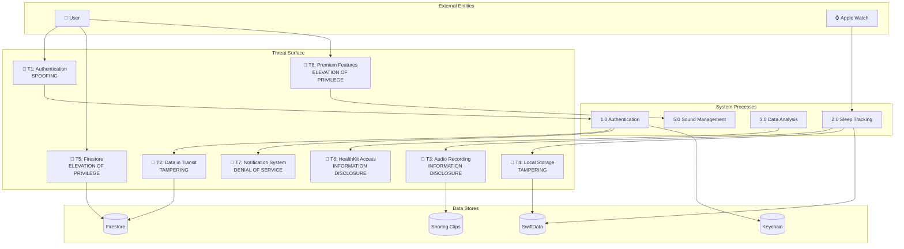

### 15.3 STRIDE Threat Analysis

| # | STRIDE Category | Threat Description | Affected Component | Impact | Mitigation |
|---|----------------|--------------------|--------------------|--------|------------|
| T1 | **Spoofing** | Attacker creates a fraudulent Sign in with Apple token to impersonate a user and access their cloud-synced sleep data. | AuthenticationService, Firebase Auth | **Confidentiality** — unauthorized access to sleep history, factors, and profile data. | Nonce-based OAuth verification: each authentication request includes a unique SHA256 nonce validated server-side by Firebase. Replay attacks are prevented because each nonce is single-use. Keychain stores user ID with hardware-backed encryption. |
| T2 | **Tampering** | Man-in-the-middle attack modifies sleep data or user profile during sync between the app and Firebase Firestore. | Network layer, CloudSyncService | **Integrity** — corrupted sleep scores, modified profile data, or injected factor data. | TLS 1.2+ enforced by iOS App Transport Security for all network traffic. Firebase SDK uses certificate pinning. Firestore Security Rules validate data structure and ownership on the server side. |
| T3 | **Information Disclosure** | Unauthorized app or process accesses stored snoring audio clips from the local filesystem, exposing private bedroom recordings. | File System (Documents/SnoringClips/) | **Confidentiality** — biometric voice data and private audio exposed. Potential for blackmail or surveillance. | iOS App Sandbox prevents other apps from accessing Slumberscope's Documents directory. iOS Data Protection encrypts files at rest (tied to device passcode). Audio clips are stored locally only — never transmitted over the network. File paths are not exposed via URL schemes or shared containers. |
| T4 | **Tampering** | Attacker with physical device access modifies SwiftData records to alter sleep history or inject false data. | SwiftData local database | **Integrity** — falsified sleep records, corrupted trend data, unreliable coaching. | iOS Data Protection encrypts the database at rest. Device passcode/biometric required to unlock. SwiftData transactions ensure atomic writes. Jailbroken device detection is out of scope for v1 but noted as a future enhancement. |
| T5 | **Elevation of Privilege** | Authenticated user attempts to access or modify another user's Firestore documents by crafting direct API requests. | Firestore | **Confidentiality & Integrity** — access to other users' profiles and sleep data. | Firestore Security Rules enforce that users can only read/write documents within their own UID-scoped path (`users/{uid}`). Firebase Auth token is validated on every request. |
| T6 | **Information Disclosure** | Malicious code or compromised dependency reads HealthKit data beyond what the user authorized. | HealthKitService | **Confidentiality** — heart rate, HRV, SpO2, temperature data exposed. | HealthKit enforces per-data-type user authorization. The app only requests specific types needed. HealthKit data is processed in-memory and displayed in UI — not persisted to SwiftData or synced to Firebase. Apple manages the HealthKit encryption domain separately from the app sandbox. |
| T7 | **Denial of Service** | Flooding the notification system with excessive scheduled notifications, degrading device performance and user experience. | NotificationService | **Availability** — user overwhelmed with alerts, potential app deletion. | Notifications are scheduled at specific, user-configured times with deduplication. Each notification type has a single pending request (replacing previous). iOS limits pending notifications to 64. |
| T8 | **Elevation of Privilege** | User bypasses the PremiumGate to access premium sounds and features without a valid subscription. | StoreKitService, PremiumGate | **Integrity** — revenue loss, unauthorized feature access. | StoreKit 2 provides server-side transaction verification with signature validation. Entitlement checks occur at the service layer (PremiumGate utility). On-device receipt validation prevents simple client-side bypasses. |

### 15.4 Security Principles and Controls

**Principles Applied:**

1. **Defense in Depth** — Multiple layers of security: iOS sandbox + Data Protection encryption + Keychain for credentials + TLS for transit + Firestore rules for cloud access.
2. **Least Privilege** — App requests only minimum required permissions; graceful degradation if any permission is denied.
3. **Separation of Duties** — Authentication (Firebase) is separate from data storage (SwiftData/Firestore); credential storage (Keychain) is separate from application data.
4. **Fail Secure** — If authentication fails, no data is synced. If HealthKit authorization is revoked, biometric reading fails gracefully with empty results.
5. **Privacy by Design** — Audio recordings never leave the device. Location is used only in-memory for weather. On-device AI processes data locally.

**Security Controls Beyond Hashed Passwords and Roles:**

| Control | Description | Status |
|---------|-------------|--------|
| **Nonce-Based OAuth** | SHA256 random nonce generated per authentication attempt, preventing replay attacks on Sign in with Apple tokens. | Implemented |
| **Keychain Credential Storage** | User identifiers and tokens stored in iOS Keychain with hardware-backed encryption (Secure Enclave on supported devices). | Implemented |
| **iOS App Transport Security** | ATS enforces TLS 1.2+ for all network connections; no plain HTTP allowed. | Implemented (system-level) |
| **Firestore Security Rules** | Server-side rules restrict document access to the authenticated user's own UID path. | Implemented |
| **Local-Only Audio Storage** | Snoring clips stored in the app sandbox's Documents directory; no network transmission of audio data. | Implemented |
| **iOS Data Protection** | Files and database encrypted at rest using iOS Data Protection (Complete protection when device is locked). | Implemented (system-level) |
| **Permission-Gated Sensor Access** | Microphone, accelerometer, HealthKit, location, and notification access all require explicit user authorization. | Implemented |
| **Minimum Data Collection** | Location used only in-memory for weather API calls; not persisted. HealthKit data displayed but not stored in app database. | Implemented |
| **Structured Security Logging** | AppLogger captures authentication events (🔐), cloud sync operations (☁️), and data access patterns across 14 categorized subsystems. | Implemented |
| **Transaction Verification** | StoreKit 2 server-side signature verification for in-app purchase receipts. | Implemented |

### 15.5 Security Controls Timeline

**Already Implemented (Current Release):**
- Sign in with Apple with nonce-based OAuth
- Keychain storage for credentials
- iOS App Transport Security (TLS 1.2+)
- Firestore Security Rules for user data isolation
- Local-only audio storage (no network transmission)
- iOS Data Protection (encryption at rest)
- Permission-gated sensor access with graceful degradation
- Minimum data collection (in-memory location, no HealthKit persistence)
- Structured logging across 14 security-relevant categories
- StoreKit 2 transaction verification
- Account deletion with cascade data removal

**Planned for Next Release:**
- Certificate pinning for Firebase API calls (beyond default SDK pinning)
- Biometric authentication (Face ID/Touch ID) to open the app
- Session timeout for cloud-synced profiles
- Audit logging for data export events
- Rate limiting on factor logging to prevent automated data injection

**Planned for Final Release:**
- Jailbreak/integrity detection with user warning
- Encrypted local backups for snoring audio clips
- Privacy dashboard showing all collected data categories with deletion options
- Security headers review for any future WebView content
- Penetration testing against OWASP MASVS L1 checklist

### 15.6 Security Assessment Plan

We plan to conduct a security assessment following the **OWASP Mobile Application Security Testing Guide (MASTG)**, aligned with **MASVS L1** (standard security) requirements:

1. **Static Analysis:** Review all source code for OWASP Mobile Top 10 vulnerabilities using Xcode's static analyzer and manual code review.
2. **Dynamic Analysis:** Test the running application using Charles Proxy to verify TLS enforcement, inspect network traffic for data leaks, and confirm no sensitive data in logs.
3. **Data Storage Audit:** Verify that credentials are in Keychain (not UserDefaults), audio files are in the sandbox, and no sensitive data is in backups or shared containers.
4. **Authentication Testing:** Attempt token replay, session hijacking, and unauthorized Firestore access with crafted requests.
5. **Permission Testing:** Deny each permission individually and verify graceful degradation without crashes or data exposure.
6. **Compliance Checklist:** Map all controls to MASVS L1 requirements and document pass/fail for each.

---

## 16. Alternative Designs

### Alternative 1: Cross-Platform (React Native / Flutter) vs. Native iOS

| Aspect | Cross-Platform | Native iOS (Chosen) |
|--------|---------------|---------------------|
| **Sensor Access** | Limited accelerometer/mic access, no HealthKit or FoundationModels | Full CoreMotion, AVFoundation, HealthKit, FoundationModels access |
| **Performance** | JavaScript/Dart bridge adds latency to real-time audio FFT | Native Swift FFT runs at hardware speed with zero bridging overhead |
| **Platform Reach** | Android + iOS from single codebase | iOS only |
| **Development Speed** | Slower due to native module bridging for sensors | Faster for iOS-specific features with SwiftUI |

**Why Not Chosen:** Cross-platform frameworks cannot access HealthKit, CoreMotion at 10 Hz, or FoundationModels. Real-time FFT-based snoring detection requires native audio engine performance. The team's primary expertise is in Swift/iOS development.

### Alternative 2: Server-Side Audio Processing vs. On-Device Processing

| Aspect | Server-Side | On-Device (Chosen) |
|--------|------------|---------------------|
| **Privacy** | Audio transmitted to servers — significant privacy concern | All audio processed locally — zero network transmission |
| **Latency** | Network round-trip delays snoring detection | Real-time detection with <100ms latency |
| **Cost** | Requires cloud GPU/compute infrastructure | Zero server cost; uses device CPU |
| **Offline** | Requires network connectivity | Works fully offline |

**Why Not Chosen:** Transmitting bedroom audio recordings to external servers poses unacceptable privacy risks for a sleep application. Users would be reluctant to adopt the app. Additionally, server costs would be prohibitive for a student project.

### Alternative 3: Core Data vs. SwiftData vs. Realm

| Aspect | Core Data | SwiftData (Chosen) | Realm |
|--------|-----------|---------------------|-------|
| **API Complexity** | Complex, verbose Objective-C heritage | Simple, Swift-native macros | Simple but third-party |
| **SwiftUI Integration** | Manual observation setup | Native `@Query` and `@Observable` | Requires wrapper |
| **Migration** | Manual migration mapping | Automatic lightweight migration | Automatic |
| **Dependency** | Apple built-in | Apple built-in (iOS 17+) | External SDK (~5 MB) |

**Why Not Chosen (Core Data):** Verbose API, manual SwiftUI integration, and legacy Objective-C patterns make it slower to develop with. **Why Not Chosen (Realm):** Adds an external dependency, increases app size, and the team preferred staying within Apple's ecosystem for long-term support guarantees.

### Alternative 4: Custom Backend (Node.js/Express) vs. Firebase

| Aspect | Custom Backend | Firebase (Chosen) |
|--------|---------------|-------------------|
| **Development Time** | Weeks to build auth, database, hosting | Hours to configure pre-built services |
| **Cost** | Hosting costs from day one | Generous free tier (50K reads/day) |
| **Maintenance** | Team must manage servers, updates, security patches | Google-managed infrastructure |
| **Scalability** | Manual scaling required | Auto-scaling built-in |

**Why Not Chosen:** Building and maintaining a custom backend is outside the project scope and budget. Firebase's free tier provides all needed functionality (auth, user profiles, settings sync) with zero infrastructure management.

### Alternative 5: Wearable-Required vs. Phone-Only Tracking

| Aspect | Wearable-Required | Phone-Only (Chosen) |
|--------|-------------------|---------------------|
| **Accuracy** | Higher (wrist-based PPG, skin temp) | Moderate (accelerometer + audio) |
| **Accessibility** | Requires $250+ Apple Watch | Requires only an iPhone |
| **User Friction** | Must charge and wear device to bed | Place phone on bed/nightstand |
| **Market Size** | ~100M Apple Watch users | ~130M+ iPhone users in U.S. |

**Why Not Chosen as Requirement:** Requiring a wearable dramatically reduces the addressable market and excludes users who cannot afford one. Slumberscope supports Apple Watch as an optional enhancement (heart rate data) but does not require it, making the app accessible to all iPhone users.

---

## 17. Progress and Plan for Completion

### 17.1 System Functions/Services Implemented to Date

| # | Feature / Service | Status | Description | Related Requirements |
|---|------------------|--------|-------------|---------------------|
| 1 | **Sleep Tracking Engine** | Implemented | Full session lifecycle: idle → calibrating → tracking → completing → done. Motion collection at 10 Hz with 30-second aggregation. Real-time FFT-based snoring detection with adaptive baseline. | FR-01, FR-02, FR-03, FR-18 |
| 2 | **Sleep Score Calculation** | Implemented | Weighted scoring algorithm (duration 35pts, quality 30pts, movement 20pts, snoring 15pts). Sleep efficiency and onset latency derivation. | FR-05 |
| 3 | **Sleep Stage Derivation** | Implemented | 30-minute sliding window analysis with calibration-adjusted thresholds for Awake, Light, Deep, and REM classification. | FR-02 |
| 4 | **Snoring Detection & Recording** | Implemented | FFT analysis of 100–500 Hz band, adaptive threshold calibration, burst grouping, 15-second WAV clip recording. | FR-03, FR-04 |
| 5 | **Calibration System** | Implemented | 20-second baseline measurement with median calculation, persisted to UserDefaults. | FR-18 |
| 6 | **Smart Alarm** | Implemented | Light-sleep detection within configurable window, gradual wake-up with volume ramping, multiple alarm sounds, snooze support. | FR-09, FR-10 |
| 7 | **Sound Library** | Implemented | 180+ sounds across 7 categories with streaming playback, real-time mixer, volume controls, timer, and saved presets. | FR-11, FR-12, FR-13 |
| 8 | **User Authentication** | Implemented | Sign in with Apple with nonce-based OAuth → Firebase Auth → Firestore profile sync. Keychain credential storage. | FR-14, FR-15 |
| 9 | **Morning Review** | Implemented | Quality rating, morning mood, notes entry, sleep score display, stage breakdown visualization. | FR-06 |
| 10 | **Factor Logging** | Implemented | 8 factor types with intensity rating, custom factor support, per-day logging. | FR-07 |
| 11 | **Factor Correlation Analysis** | Implemented | Statistical comparison of sleep metrics with/without factors, minimum sample enforcement, insight generation. | FR-08 |
| 12 | **HealthKit Integration** | Implemented | Write sleep sessions, read HR/HRV/SpO2/respiratory rate/temperature during sleep window. | FR-16 |
| 13 | **AI Sleep Coaching** | Implemented | FoundationModels integration for personalized tips with rule-based fallback for unsupported devices. | FR-17 |
| 14 | **Notifications** | Implemented | Bedtime reminders, morning summaries, weekly digests, streak celebrations, battery warnings, goal achievements. | FR-20, FR-28 |
| 15 | **Crash Recovery** | Implemented | Auto-save every 5 minutes, restoration prompt on app relaunch. | FR-19 |
| 16 | **Sleep Schedule Management** | Implemented | Weekday/weekend schedules, shift work mode, vacation mode, wind-down reminders. | FR-21 |
| 17 | **Reports & Trends** | Implemented | Sleep charts, weekly snapshots, streak tracking, history view with session details. | FR-22 |
| 18 | **Data Export** | Implemented | CSV export of all sessions, PDF report generation with charts and statistics. | FR-23 |
| 19 | **Premium Subscriptions** | Implemented | StoreKit 2 with monthly/yearly/lifetime tiers, transaction verification, premium feature gating. | FR-24 |
| 20 | **Widgets & Live Activities** | Implemented | Home Screen widget, Lock Screen widget, Live Activity during tracking. | FR-25 |
| 21 | **Weather Context** | Implemented | WeatherKit integration displaying temperature and conditions in morning review. | FR-26 |
| 22 | **Apple Watch Connectivity** | Implemented | WatchConnectivity for heart rate data from paired Apple Watch. | FR-27 |
| 23 | **Onboarding** | Implemented | 5-step onboarding flow with team intro, account setup, sign-in, permissions, and tutorial. | FR-30 |
| 24 | **Sleep Focus Mode** | Implemented | Activates Do Not Disturb when tracking begins. | FR-29 |

### 17.2 Release Plan

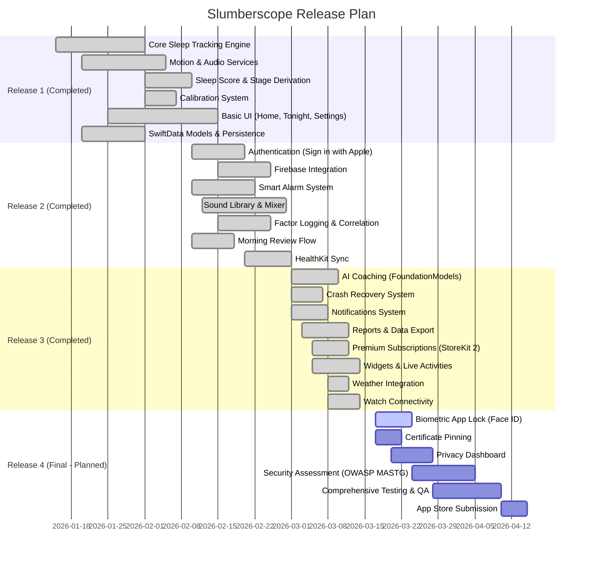

### 17.3 Team Member Responsibilities

| Team Member | Role | Release 4 (Final) Responsibilities |
|-------------|------|--------------------------------------|
| **Simon Alberico** | Cyber Security Lead | Biometric app lock (Face ID/Touch ID) implementation. Certificate pinning for Firebase API calls. OWASP MASVS L1 security assessment and compliance documentation. Penetration testing (network traffic analysis, data storage audit, permission testing). Security controls documentation and final threat model update. |
| **Ananjin Batdelger** | Software Engineering Lead | Privacy dashboard UI and data deletion workflow. Comprehensive unit and integration testing. Performance optimization and battery consumption testing. App Store submission preparation (screenshots, metadata, privacy nutrition labels). Code review and final refactoring. |
| **Aia Ahmed** | Computer Science Lead | Encrypted local backup system for snoring audio clips. Enhanced reporting and analytics features. Final UI polish, accessibility audit, and Dark Mode verification. User acceptance testing coordination. Documentation (user guide, API documentation). |

---

*This report reflects the most up-to-date and comprehensive version of the Slumberscope project as of March 17, 2026.*

*Prepared by: Simon Alberico, Ananjin Batdelger, Aia Ahmed*
